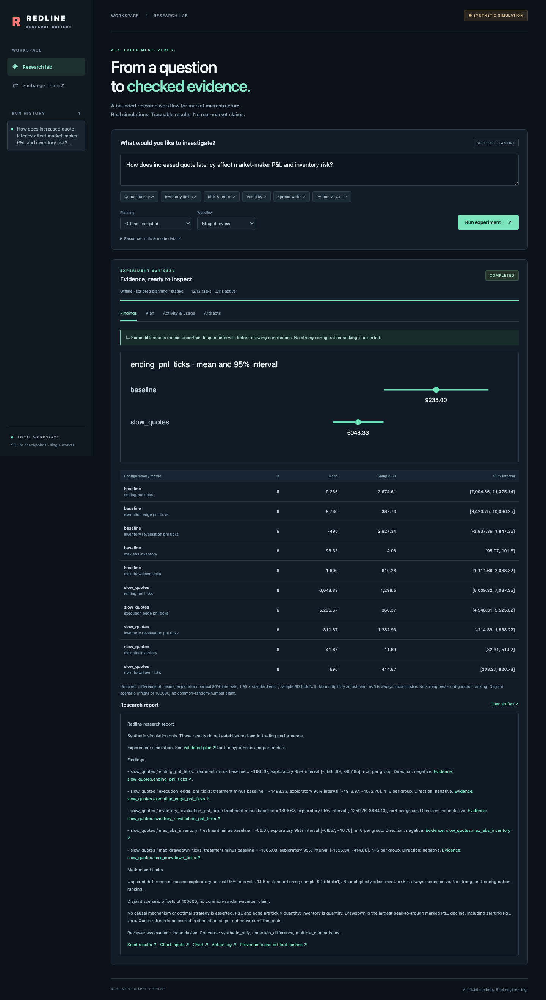
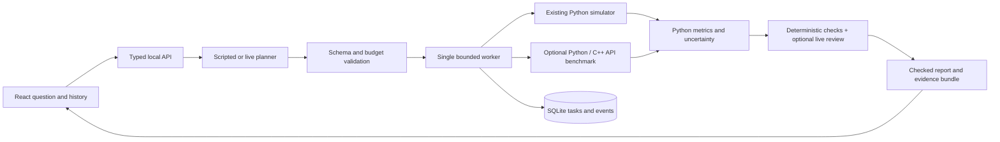

# Redline Research Copilot

Turn a market-microstructure question into a validated experiment, run it across
seeds, and inspect an evidence-backed report. Built on **Redline Exchange**:
Python orchestration and simulation, an optional C++17 matching core,
TypeScript/React interface, and SQLite persistence.

**Synthetic simulation only.** Offline planning is visibly **scripted**; it still
executes real simulations. Optional live AI selects plans and reviews relevance.
No live prices, exchange connectivity or brokerage orders.

**[Open the free public demo](https://redline-research-copilot.onrender.com/)** —
select an example and run it. Scripted planning, real simulations, shared temporary
history. The free host sleeps when idle; the first visit may take a minute.
[Hosting details](docs/DEPLOYMENT.md).



## Run locally

Python 3.11+, Node 22+, pnpm 11.19.0; macOS/Linux/WSL. Install once while online:

```bash
python -m venv .venv
source .venv/bin/activate
python -m pip install -e '.[dev,demo]'
pnpm --dir web install --frozen-lockfile
pnpm --dir web run build
```

Then one command starts the offline application:

```bash
python copilot.py
```

Open **http://127.0.0.1:8001**. Select **Quote latency**, then **Run experiment**.
Inspect Findings, Plan, Activity & usage, and Artifacts. History survives restarts
in `.research-data/research.sqlite3`; set `REDLINE_RESEARCH_DIR` for another store.
The built offline app needs no external services, API key or paid subscription.

**Example:** “How does increased quote latency affect market-maker P&L and
inventory risk?” With 500 steps and six seeds per configuration, the saved study
has mean ending P&L **9,235.00** for baseline and **6,048.33** for slower refresh.
The difference is **−3,186.67 tick × quantity**, exploratory 95% interval
**[−5,565.69, −807.65]**. This is a result from this artificial simulator.
[Actual generated report](docs/research/example/report.md) ·
[Seed table](docs/research/example/results.csv) ·
[Provenance and artifact hashes](docs/research/example/evidence.json).

## What the agents decide

The live **planner** maps language to supported controls. A separate live
**reviewer** checks question/plan relevance and methodological concerns.
The runner and reporter are ordinary code: scheduling, budgets, arithmetic,
uncertainty, evidence IDs and numerical wording never depend on a model's math.
Offline uses six prewritten plans and deterministic review. There is no
open-ended agent conversation and no automatic plan revision.



Mistakes are detected through closed tool schemas, parameter limits, task-result
validation, evidence-reference checks, budgets and required-artifact checks.
A model cannot run shell commands or declare success. [Architecture, methods,
API, recovery and limits](docs/RESEARCH_COPILOT.md).

## Live AI — optional, not required

Use the variables in [`.env.example`](.env.example). Export `OPENAI_API_KEY` and
`OPENAI_MODEL` in your shell, restart the app, and select **Live AI**. Choose an
account-accessible model supporting Responses structured outputs; no assumed
“latest” model is hardcoded. The template is not automatically loaded.
Provider usage is shown only when supplied; monetary cost is unavailable.
**Live calls and live comparative evaluation have not been run in this environment.**
The adapter is tested with mocked transport. [Provider setup and sources](docs/RESEARCH_COPILOT.md#live-provider).

## Validation and evaluation

```bash
python -m pytest -q
python -m ruff check .
python -m ruff format --check .
python -m research_copilot.evaluate --output docs/research/evaluation
python scripts/research_recovery.py
pnpm --dir web exec playwright install chromium
pnpm --dir web test
pnpm --dir web run test:research
```

Local validation: **136 Python tests passed**, including original regressions
and native parity. Research and exchange browser flows passed. The versioned
suite has five supported, three ambiguous, three unsupported, three injection
and two insufficient-evidence cases. Both scripted workflows passed **16/16**;
both completed **5/5** supported studies. No multi-agent advantage is established.
[Measured comparison and raw rows](docs/research/evaluation/RESULTS.md).

Recovery demonstration: fail task four after three successful checkpoints,
resume, and finish with **12 unique tasks**. Failed work remains charged:
**6,500** work units including the failed attempt.
[Recorded output](docs/research/recovery.json).

## Existing exchange and C++ core

`python demo.py` still starts the exchange lab at **http://127.0.0.1:8000**.
Its guided scenario fills a 130-share buy with **100 at $101.00 and 30 at $101.05**,
then demonstrates same-price FIFO, symbol isolation and session replay.
[Exchange walkthrough and contract](docs/EXCHANGE.md) · [Engine design](docs/DESIGN.md).

For the optional C++ comparison:

```bash
python -m pip install -e '.[dev,demo,native,research]'
python scripts/build_native.py
python copilot.py
```

Choose **Python vs C++**. This times existing core API calls after parity checks;
it is a small local timing experiment, not an exchange capacity test. The market
simulator itself still uses the Python reference book. Main's C++17 implementation
is preserved; the separate draft implementation in PR #3 is not incorporated.
[Native boundary](docs/NATIVE.md) · [Original benchmark methods](docs/BENCHMARKS.md).

The original study was rerun with 100,000 events, five trials, seeds 17/42/73:
Python-facing C++/Python throughput ratios **1.25×–2.77×** on this host.
[Recorded core study](docs/research/core-study/STUDY.md). Core timings exclude
HTTP/SQLite/UI; [workflow and browser latency](docs/RESEARCH_COPILOT.md#validation-record)
are recorded separately. No matching or existing benchmark implementation changed.

## Free public hosting

[Render deployment configuration and public-mode limits](docs/DEPLOYMENT.md)
provide a free, example-only public demo with temporary shared history. The
local app retains private questions, optional live AI, and persistent local
history. A Render login is required to publish; configuration alone is not a
verified deployment.

## Limits

Single local process, one worker, four queued/running requests, 100 saved runs.
Cancellation takes effect between bounded tasks. Small samples, unadjusted
exploratory intervals, artificial order flow and a single host limit conclusions.
No production readiness or real trading performance is claimed. Next steps are
live-model evaluation, stronger statistical designs and additional simulator
capabilities supported by tests. [MIT license](LICENSE).
