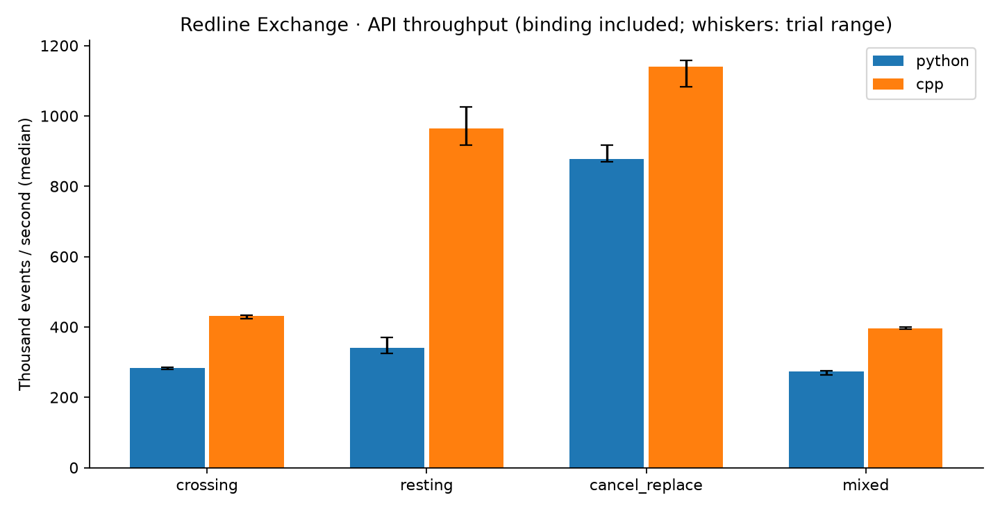

# Redline Exchange

A deterministic price-time-priority limit order book: **Python for research,
C++17 for the matching core**, with exact behavioral comparisons and measured
performance. Built to study matching rules, data structures, and the cost of a
Python/native boundary.

[Architecture](docs/DESIGN.md) · [Native interface](docs/NATIVE.md) ·
[Benchmark method](docs/BENCHMARKS.md) · [Profile findings](docs/PROFILING.md)

## Five stages, one project

| Stage | Delivered |
|---|---|
| V1 · Python CLOB | Matching, cancel/replace, replay, invariants and market simulation |
| V2 · Benchmark | Prepared streams, orders/events per second, p50/p95/p99, repeated trials |
| V3 · Profile | cProfile hotspots and separate Python allocation measurements |
| V4 · C++ core | Independent C++17 matching state plus optional pybind11 adapter |
| V5 · Compare | Exact output/state parity followed by identical-workload measurements |

## Measured result

Re-measured on **2026-09-21 (America/Chicago)**, using an **Apple M5 (10 physical cores, 16 GiB
memory), macOS 26.5.1 arm64, Python 3.12.14, Zig 0.13.0 / Clang 18.1.6**.
Release flags include `-O3` and deployment target `aarch64-macos.14.0`.
100,000 events per workload, seed 17, median of five trials. **C++ includes the
Python binding and conversion to the same Python result objects.**

| Workload | Python events/s | C++ events/s | C++ / Python |
|---|---:|---:|---:|
| crossing | 283,217 | 430,584 | 1.52× |
| resting | 341,272 | 965,018 | 2.83× |
| cancel_replace | 876,881 | 1,139,952 | 1.30× |
| mixed | 272,991 | 396,570 | 1.45× |

The [three-seed study](docs/performance/STUDY.md) repeats the protocol with seeds
17, 42 and 73 in separate processes: 120 throughput trials plus separate latency
passes. Ratios of medians span **1.29×–2.83×** across workload/seed pairs.
Every trial is retained. Chart whiskers show the seed-17 trial minimum/maximum,
not a confidence interval.

Crossing/resting contain only submissions, so events/s equals orders/s. Other
workloads also count cancels/replacements. These synthetic single-host API
measurements exclude network/persistence and do not establish production capacity.

```bash
python study.py --orders 100000 --repeats 5 --seeds 17 42 73 --output docs/performance
```



[Latency and trial ranges](docs/performance/SUMMARY.md) ·
[Raw CSV](docs/performance/results.csv) · [Build metadata](docs/performance/results.json)
· [Shipping validation](docs/SHIPPING.md)

## Features

- limit and market orders;
- buy and sell sides;
- price-time priority;
- partial fills across multiple price levels;
- cancellation by order ID;
- cancel/replace with explicit queue-priority rules;
- deterministic CSV event replay;
- resting-order (maker) execution prices;
- top-of-book and depth snapshots;
- integer price ticks to avoid floating-point money errors;
- invariant and property-based tests;
- repeated throughput, p50/p95/p99 latency, profiling and Python/C++ parity tests.

## Quickstart

```bash
git clone https://github.com/asoracca/redline-exchange.git
cd redline-exchange
python -m venv .venv
source .venv/bin/activate
python -m pip install -e ".[dev]"

python -m pytest -q
python -m orderbook.cli
redline-demo
redline-replay examples/events.csv --symbol DEMO
python compare.py --python-only --orders 10000 --repeats 3
```

On Windows PowerShell, activate the environment with:

```powershell
.venv\Scripts\Activate.ps1
```

## Build and compare C++

Requires a C++17 compiler; [native setup](docs/NATIVE.md) includes macOS and WSL
instructions and an optional Zig compiler path.

```bash
python -m pip install -e ".[dev,native,research]"
python scripts/build_native.py
python -c "from orderbook import _native; print(_native.compiler)"
python -m pytest -q
python compare.py --orders 100000 --repeats 5 --output benchmark-results
python profile_matching.py --orders 100000 --output profile-results
python study.py --orders 100000 --repeats 5 --seeds 17 42 73
```

The original `benchmark.py` still works; its end-to-end timing method differs
from the new prepared-stream comparison.

## Example

```python
from orderbook import LimitOrderBook, Side

book = LimitOrderBook(symbol="DEMO")
book.submit_limit("sell-1", Side.SELL, quantity=100, price_ticks=10100)
trades = book.submit_limit("buy-1", Side.BUY, quantity=40, price_ticks=10100)

print(trades[0])
print(book.top_of_book())
```

`10100` means 101.00 when the tick size is one cent. The engine stores integer ticks internally.

## Matching rules

1. Better prices execute first.
2. At the same price, earlier orders execute first.
3. A trade executes at the resting order's price.
4. Unfilled limit quantity rests on the book.
5. Unfilled market quantity is canceled rather than resting.

## Replace rules

`replace(order_id, new_quantity, new_price_ticks=None)` treats quantity as the
new **remaining** quantity.

- Reducing quantity at the same price keeps the original sequence and priority.
- Increasing quantity loses priority.
- Changing price loses priority and may immediately trade.
- Zero quantity is rejected; use `cancel` instead.

Heap entries include price, sequence, and order ID. A stale entry from a cancel
or replacement cannot be mistaken for the active version of an order.

## Correctness checks

`assert_invariants()` verifies that active orders have valid heap entries, the
book is not crossed after matching, trade sequences increase, quantities remain
positive, and no order trades more than its maximum accepted quantity.

The Hypothesis test suite generates randomized submissions, markets, cancels,
and replacements and checks these invariants after every event.

See [event replay](docs/REPLAY.md) and [benchmark methodology](docs/BENCHMARKS.md).

See [docs/DESIGN.md](docs/DESIGN.md) for the data structures, complexity, and extension plan.

## Market microstructure research

Redline Market Lab adds deterministic noise traders, informed traders, and an
inventory-aware market maker on top of the Python matching engine. It tests
how informed flow, quote latency, volatility, and inventory limits affect
marked P&L and risk.

```bash
python -m pip install -e ".[research]"
python run_market_lab.py
python run_market_study.py
```

The second runner repeats five scenarios over 50 common random seeds, reports
approximate 95% confidence intervals, decomposes P&L into execution edge and
inventory revaluation, and creates a scenario chart. See
[the methodology](docs/MARKET_LAB.md) and [results](docs/RESULTS.md).

## Scope and next steps

Single-threaded, single-symbol, in-memory educational engine. It does not provide
network access, durable logs, brokerage execution, or production latency guarantees.
The C++ backend has an explicit numeric range; Python keeps arbitrary-size integers.
Both retain seen IDs and lazily discarded heap entries, so memory can grow even
when few orders remain active. See [the interface contract](docs/NATIVE.md).

Next experiments: larger/multiple-seed workloads, heap compaction under long-lived
churn, and separately measured depth aggregation or batch bindings. Keep research
in Python and let profiling determine which additional work belongs in C++.

[Implementation changes](docs/CHANGES.md)

[Follow-up validation and changes](docs/CONTINUATION.md)
