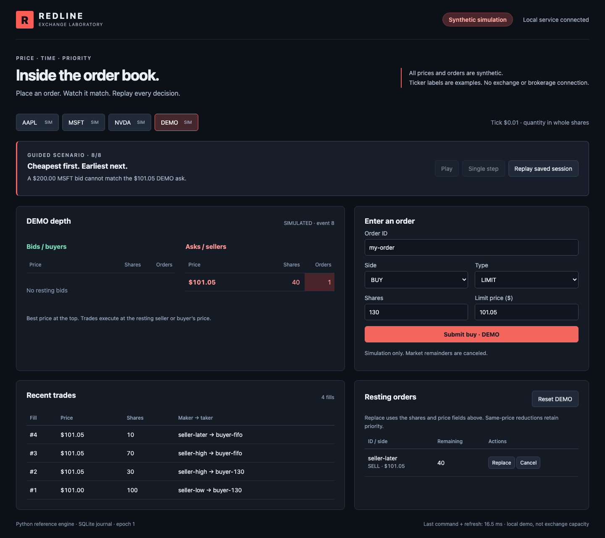

# Redline Exchange

An interactive laboratory for **price-time priority**, with a Python reference
engine, optional C++17 matching core, TypeScript/React UI and SQLite event journal.
The default mode is **synthetic simulation**. AAPL, MSFT, NVDA and DEMO are book
labels, not exchange connections or live prices. No brokerage orders are sent.



## Run the offline demo

Requires Python 3.11+, Node 22+ and pnpm 11.19.0 on macOS/Linux/WSL. Install once
while online; running the built demo needs no credentials or external services:

```bash
python -m venv .venv
source .venv/bin/activate
python -m pip install -e '.[dev,demo]'
pnpm --dir web install --frozen-lockfile
pnpm --dir web run build
```

Then **one command starts the offline demo**:

```bash
python demo.py
```

Open <http://127.0.0.1:8000>. Choose **Single step** or **Play**. The guided lesson
shows a 130-share buy filling **100 at $101.00 and 30 at $101.05**, then FIFO at a
shared price and a second symbol that cannot match the first. **Replay saved
session** verifies the same final state and trades in fresh books, with pause
and single-step controls. [Two-minute walkthrough and service contract](docs/EXCHANGE.md).

The UI includes depth, recent trades, order entry, cancel/replace and per-symbol
reset. Reset preserves the append-only journal. By default it is `redline.sqlite3`;
set `REDLINE_DB=/path/to/new.sqlite3` for a separate saved session.

## How it works

Python validates requests and serializes writes, routing each symbol to its own
existing book. Matching stays in Python or the C++17 core behind the same API.
SQLite commits commands and results before SSE publishes them. Server-owned
OpenAPI generates the TypeScript client contract. Reconnects use a sequence
cursor and coherent snapshot. [Architecture, persistence and limits](docs/EXCHANGE.md).

Prices are integer cent ticks; quantities are whole synthetic shares. Better
prices execute first, FIFO breaks price ties, and fills use the maker price.
Replacement quantity means new **remaining** shares. Same-price reductions keep
priority; increases/repricing lose it. IDs are single-use per symbol/book epoch.
Heap entries include price, sequence and ID, so canceled or replaced stale
entries cannot masquerade as active orders. [Engine design](docs/DESIGN.md).

## Native engine and validation

```bash
python -m pip install -e '.[dev,demo,native,research]'
python scripts/build_native.py
python -m pytest -q
REDLINE_BACKEND=cpp python demo.py
```

[Native setup and Python/C++ boundary](docs/NATIVE.md) includes an optional Zig
compiler path. PR #3 proposes another implementation; the lab preserves main's
existing C++17 core and does not incorporate that draft.

```bash
python -m ruff check .
python -m ruff format --check .
pnpm --dir web exec playwright install chromium
pnpm --dir web test
```

Tests retain the original engine regressions, randomized invariants and seeded
per-event native parity, and add service isolation, journal recovery, idempotency,
concurrent ordering, API validation, replay/reconnect and browser flows. CI builds
both backends and the UI. [Methods and local results](docs/EXCHANGE.md).

## Measurements and research

The original three-seed study uses 100,000 events per workload, five trials and
seeds 17, 42, 73. Recorded Python-facing C++/Python throughput ratios span
**1.29×–2.83×** across workload/seed pairs. It includes binding conversion and
excludes networking/persistence. [Study and raw results](docs/performance/STUDY.md).

```bash
python study.py --orders 100000 --repeats 5 --seeds 17 42 73 --output docs/performance
python scripts/measure_service.py --events 200
```

The separate service sample measures core calls and SQLite-backed calls; browser
latency is measured separately. None establishes production exchange capacity.
[Benchmark method](docs/BENCHMARKS.md) · [Profiling](docs/PROFILING.md).

Existing CLI and research workflows remain available:

```bash
redline-demo
redline-replay examples/events.csv --symbol DEMO
python run_market_lab.py
python run_market_study.py
```

[Market microstructure methods](docs/MARKET_LAB.md) · [Research results](docs/RESULTS.md).

## Scope

A loopback-only, single-process educational service: four symbols, 2,000 journal
events per database, eight event streams, no distributed writers or authentication.
One global writer favors clarity over parallel throughput. Native seen IDs and
stale heap entries grow within the bounded session. Future historical/live feeds
must be separately labeled read-only adapters. This is not a trading strategy,
market-data provider or production exchange. [MIT license](LICENSE).

[Implementation changes](docs/CHANGES.md) · [Previous validation](docs/CONTINUATION.md)
