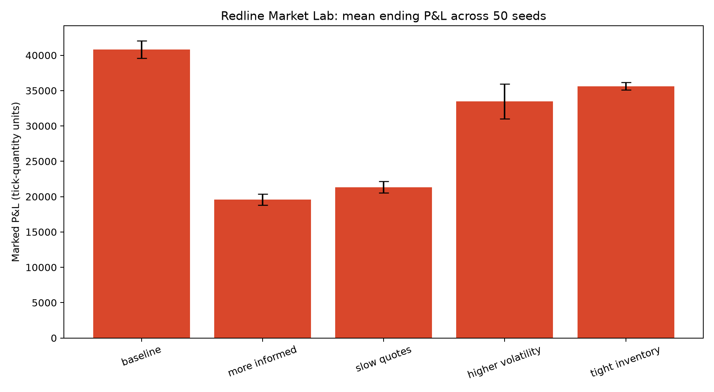

# Market Lab results

## Initial deterministic experiment

The initial run uses 5,000 steps and seed 17. P&L is measured in tick-quantity
units and inventory is marked to the simulated fundamental value.

| Scenario | Ending P&L | Max inventory | Fills | Informed volume share |
| --- | ---: | ---: | ---: | ---: |
| Baseline | 109,150 | 100 | 4,127 | 9.2% |
| More informed flow | 51,300 | 100 | 2,787 | 28.0% |
| Slow quote refresh | 50,500 | 70 | 1,882 | 8.2% |
| Higher volatility | 101,240 | 100 | 4,450 | 15.4% |
| Tight inventory | 90,570 | 30 | 3,638 | 7.5% |

In this seeded experiment, greater informed participation and slower quote
refreshes both reduce ending marked P&L relative to the baseline. The tighter
inventory scenario successfully caps absolute inventory at 30 units, with a
lower ending P&L than the unconstrained baseline.

These are descriptive results from a stylized synthetic market. They are not
statistical evidence, a calibrated model of a real venue, or a claim of
tradable profitability. A later study should run many seeds, report confidence
intervals, separate spread capture from inventory revaluation, and sweep each
parameter rather than compare one setting at a time.

## Multi-seed study

The follow-up study runs each 2,000-step scenario over the same 50 random seeds.
Intervals below are normal-approximation 95% confidence intervals for mean
ending marked P&L.

| Scenario | Mean ending P&L | Approximate 95% CI |
| --- | ---: | ---: |
| Baseline | 40,807.8 | [39,561.4, 42,054.2] |
| More informed flow | 19,587.6 | [18,795.1, 20,380.1] |
| Slow quote refresh | 21,345.6 | [20,508.3, 22,182.9] |
| Higher volatility | 33,495.2 | [31,035.8, 35,954.6] |
| Tight inventory | 35,631.0 | [35,093.5, 36,168.5] |

Across these controlled simulations, informed flow and slower quote refreshes
produce the largest reduction in the market maker's marked P&L. Higher
volatility also lowers the mean and widens uncertainty. Tight inventory reduces
mean P&L but sharply constrains exposure. Because all scenarios use common
seeds, the next methodological improvement should estimate paired differences
rather than compare marginal confidence intervals.
